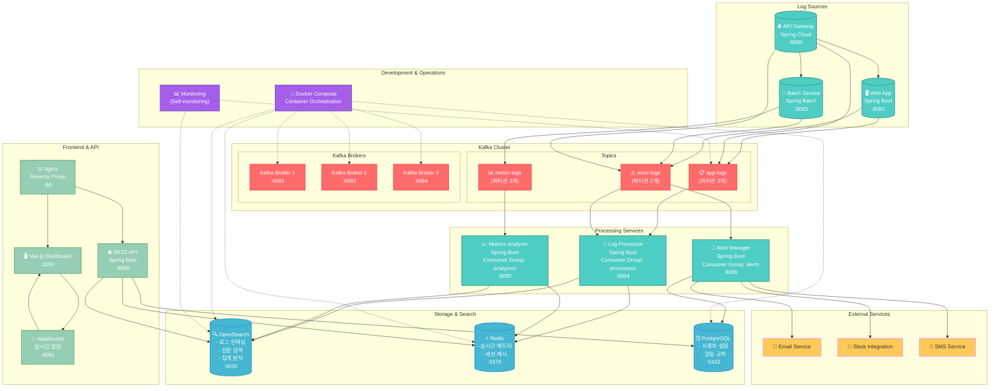

# 실시간 로그 모니터링 시스템 - PRD

## 📋 프로젝트 개요

### 1.1 프로젝트 목적
분산 시스템 환경에서 발생하는 로그를 실시간으로 수집, 분석, 모니터링할 수 있는 통합 플랫폼 구축

### 1.2 배경 및 필요성
- **프로젝트 목표**: 중앙화된 로그 관리 및 실시간 모니터링 체계 구축
- **기술적 목표**: Kafka를 활용한 고성능 메시지 처리 및 분산 시스템 구축 경험

### 1.3 프로젝트 범위
- **포함**: 로그 수집, 실시간 처리, 검색, 알림, 대시보드
- **제외**: 로그 파일 직접 수집, 복잡한 머신러닝 분석
- **1차 목표**: 단일 서버 환경에서 동작하는 완전한 시스템
- **2차 목표**: Kafka 클러스터 및 분산 환경으로 확장

---

## 🎯 핵심 기능 요구사항

### 2.1 로그 수집 (Log Collection)
**우선순위: 높음**

**기능 설명**
- 여러 Spring Boot 애플리케이션에서 발생하는 로그를 실시간으로 수집
- 구조화된 JSON 형태로 로그 표준화
- Kafka를 통한 비동기 전송으로 애플리케이션 성능 영향 최소화

**상세 요구사항**
- 로그 레벨별 분류 (DEBUG, INFO, WARN, ERROR, FATAL)
- 서비스별 로그 구분 및 추적 가능
- 요청별 TraceID를 통한 분산 추적
- 메타데이터 포함 (타임스탬프, 서비스명, 사용자 정보 등)

**수용 기준**
- 로그 전송 지연시간 < 10ms
- 로그 손실률 < 0.01%
- 애플리케이션 성능 영향 < 5%

### 2.2 실시간 로그 처리 (Real-time Processing)
**우선순위: 높음**

**기능 설명**
- Kafka Consumer를 통한 실시간 로그 스트림 처리
- 로그 파싱, 정규화, 인덱싱 수행
- 배치 처리를 통한 성능 최적화

**상세 요구사항**
- 여러 Consumer Group으로 병렬 처리
- 실패한 메시지에 대한 재처리 로직
- OpenSearch 벌크 인덱싱으로 성능 최적화
- 로그 데이터 유효성 검증 및 필터링

**수용 기준**
- 처리 지연시간 < 3초
- 처리량 > 10,000 logs/sec
- 시스템 가용성 > 99.9%

### 2.3 로그 검색 및 분석 (Search & Analytics)
**우선순위: 높음**

**기능 설명**
- OpenSearch 기반 전문 검색 기능
- 다양한 필터 조건 지원
- 실시간 메트릭 분석 및 시각화

**상세 요구사항**
- **기본 검색**: 키워드, 날짜 범위, 서비스별, 로그 레벨별 검색
- **고급 검색**: 정규식, 복합 조건, 집계 쿼리
- **실시간 메트릭**: TPS, 에러율, 응답시간 통계
- **시계열 분석**: 시간대별 트렌드 분석

**수용 기준**
- 검색 응답시간 < 1초
- 동시 검색 사용자 > 10명
- 인덱스 크기 최적화 (압축률 > 70%)

### 2.4 실시간 알림 (Real-time Alerting)
**우선순위: 중간**

**기능 설명**
- 사용자 정의 알림 규칙 기반 실시간 알림 발송
- 다양한 알림 채널 지원
- 알림 중복 제거 및 이력 관리

**상세 요구사항**
- **알림 조건**: 에러율 임계값, 특정 키워드 발생, 서비스 다운
- **알림 채널**: 이메일, Slack, 웹 푸시
- **알림 관리**: 중복 제거, 알림 주기 설정, 알림 히스토리
- **사용자 관리**: 개인별 알림 설정, 권한 관리

**수용 기준**
- 알림 지연시간 < 30초
- 알림 정확도 > 95%
- 중복 알림 비율 < 5%

### 2.5 대시보드 (Dashboard)
**우선순위: 중간**

**기능 설명**
- Vue.js 기반 실시간 모니터링 대시보드
- 커스터마이징 가능한 위젯
- WebSocket을 통한 실시간 업데이트

**상세 요구사항**
- **실시간 로그 스트림**: 최신 로그 실시간 표시
- **메트릭 차트**: 시계열 차트, 파이 차트, 게이지
- **서비스 상태**: 각 서비스별 헬스 체크 현황
- **사용자 설정**: 개인별 대시보드 커스터마이징

**수용 기준**
- 초기 로딩시간 < 3초
- 실시간 업데이트 지연 < 1초
- 반응형 디자인 지원

---

## 🏗️ 시스템 아키텍처

### 3.1 로그 소스 애플리케이션
- **Web App**: REST API 서버 (포트: 8081)
- **Batch Service**: Spring Batch 기반 배치 처리 (포트: 8083)
- **API Gateway**: Spring Cloud Gateway (포트: 8080)

### 3.2 메시지 브로커
- **Kafka Cluster**: 3-broker 클러스터 구성
- **Topics**: app-logs, error-logs, metric-logs
- **Partitioning**: 서비스별, 로그레벨별 분산

### 3.3 처리 서비스
- **Log Processor**: 로그 파싱 및 인덱싱 (포트: 8084)
- **Metrics Analyzer**: 실시간 메트릭 분석 (포트: 8085)
- **Alert Manager**: 알림 처리 (포트: 8086)

### 3.4 저장소
- **OpenSearch**: 로그 검색 및 분석
- **Redis**: 실시간 메트릭 캐싱
- **PostgreSQL**: 사용자 설정 및 알림 규칙

### 3.5 사용자 인터페이스
- **REST API**: Spring Boot 기반 API 서버 (포트: 8090)
- **Vue.js Dashboard**: 웹 대시보드 (포트: 3000)
- **WebSocket**: 실시간 통신 (포트: 8091)

---

## 🛠️ 기술 스택

### 4.1 백엔드
- **언어 및 프레임워크**: Java 21, Spring Boot 3.2+
- **메시지 브로커**: Apache Kafka 2.8+
- **검색 엔진**: OpenSearch 2.x
- **캐시**: Redis 7.x
- **데이터베이스**: PostgreSQL 15+
- **빌드 도구**: Maven

### 4.2 프론트엔드
- **프레임워크**: Vue.js 3.x with Composition API
- **상태관리**: Pinia
- **차트 라이브러리**: Chart.js
- **빌드 도구**: Vite

### 4.3 인프라
- **컨테이너화**: Docker, Docker Compose
- **웹 서버**: Nginx (리버스 프록시)
- **모니터링**: 자체 구축한 로그 모니터링 시스템

### 4.4 개발 도구
- **IDE**: IntelliJ IDEA / Cursor
- **버전 관리**: Git
- **프로젝트 구조**: Monorepo

---

## 📊 성능 요구사항

### 5.1 처리량 (Throughput)
- **로그 수집**: 50,000 logs/sec
- **동시 사용자**: 50명
- **검색 TPS**: 1,000 queries/sec
- **API 응답**: 1,000 requests/sec

### 5.2 응답시간 (Latency)
- **로그 전송**: < 10ms
- **실시간 처리**: < 3초
- **검색 응답**: < 1초
- **대시보드 로딩**: < 3초

### 5.3 가용성 (Availability)
- **시스템 가용성**: 99.9%
- **데이터 내구성**: 99.99%
- **복구 시간**: < 1시간

### 5.4 확장성 (Scalability)
- **수평 확장**: Kafka 파티션 증가로 처리량 확장
- **수직 확장**: 메모리/CPU 증설로 성능 향상
- **데이터 증가**: 일일 100GB 데이터 처리 가능

---

## 🗃️ 데이터 관리

### 6.1 데이터 보관 정책
- **일반 로그**: 7일 보관
- **에러 로그**: 30일 보관
- **메트릭 데이터**: 3일 보관 (Redis), 30일 보관 (OpenSearch)
- **사용자 데이터**: 영구 보관

### 6.2 백업 및 복구
- **자동 백업**: 일일 PostgreSQL 백업
- **데이터 복구**: Point-in-time recovery 지원
- **재해 복구**: RTO 1시간, RPO 15분

---

## 🚀 구현 단계

### Phase 1: 기본 인프라 (2주)
- Kafka, OpenSearch, Redis, PostgreSQL 설정
- Docker Compose 환경 구축
- 기본 Spring Boot 애플리케이션 템플릿

### Phase 2: 핵심 기능 (3주)
- 로그 수집 및 전송 구현
- Log Processor 구현
- 기본 검색 API 구현
- 간단한 Vue.js 대시보드

### Phase 3: 고급 기능 (3주)
- Metrics Analyzer 및 Alert Manager 구현
- 고급 검색 기능
- 실시간 대시보드 완성
- 사용자 관리 시스템

### Phase 4: 최적화 및 확장 (2주)
- 성능 최적화
- 클러스터 구성 준비
- 모니터링 및 로깅 개선
- 문서화 및 테스트

---

## 📈 성공 지표

### 7.1 기술적 지표
- **로그 처리 성공률**: > 99.9%
- **검색 응답시간**: < 1초
- **시스템 가용성**: > 99.9%
- **메모리 사용 효율성**: < 80%

### 7.2 사용성 지표
- **대시보드 접속률**: 일일 활성 사용자 > 80%
- **검색 사용률**: 일일 검색 횟수 > 100회
- **알림 정확도**: > 95%

### 7.3 학습 목표 달성도
- **Kafka 활용**: 고성능 메시지 처리 시스템 구축
- **분산 시스템**: 마이크로서비스 간 통신 및 데이터 일관성
- **실시간 처리**: 스트리밍 데이터 처리 및 분석
- **Vue.js 활용**: 현대적인 프론트엔드 개발

---

## ⚠️ 위험 요소 및 대응 방안

### 8.1 기술적 위험
- **위험**: Kafka 메시지 손실
- **대응**: 복제 팩터 설정, 적절한 ack 설정

- **위험**: OpenSearch 인덱스 성능 저하
- **대응**: 샤딩 전략, 인덱스 템플릿 최적화

### 8.2 운영상 위험
- **위험**: 대용량 데이터로 인한 디스크 부족
- **대응**: 자동 로그 로테이션, 압축 정책

- **위험**: 메모리 부족으로 인한 시스템 다운
- **대응**: JVM 힙 사이즈 최적화, 모니터링 알림

---

## 📚 참고 자료

### 9.1 공식 문서
- [Apache Kafka Documentation](https://kafka.apache.org/documentation/)
- [OpenSearch Documentation](https://opensearch.org/docs/)
- [Spring Boot Reference](https://docs.spring.io/spring-boot/docs/current/reference/html/)
- [Vue.js Guide](https://vuejs.org/guide/)

### 9.2 관련 프로젝트
- ELK Stack (Elasticsearch, Logstash, Kibana)
- Kafka Connect Ecosystem
- Spring Cloud Sleuth (분산 추적)
